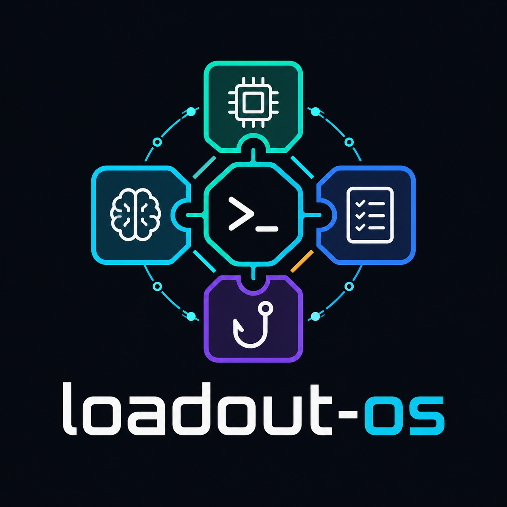

<p align="center">
  <a href="README.ja.md">日本語</a> | <a href="README.zh.md">中文</a> | <a href="README.es.md">Español</a> | <a href="README.fr.md">Français</a> | <a href="README.hi.md">हिन्दी</a> | <a href="README.md">English</a> | <a href="README.pt-BR.md">Português (BR)</a>
</p>

<p align="center"></p>


**Un sistema operativo di conoscenza per agenti di codifica AI.** Un'unica CLI che indirizza il contesto corretto al modello su richiesta, invece di caricare tutti i file di memoria e le regole nella finestra di contesto all'inizio di ogni sessione.

I tuoi file di istruzioni e gli archivi di memoria crescono senza limiti. Ogni riga costa token in ogni prompt, indipendentemente dal fatto che sia rilevante per il compito attuale o meno. loadout-os mantiene un piccolo indice di distribuzione sempre caricato e carica i dati più pesanti (argomenti di memoria, file di regole) solo quando le parole chiave del compito corrispondono. Pensalo come un equipaggiamento di gioco: fornisci all'agente esattamente la conoscenza di cui ha bisogno per la missione che lo attende.

## Cosa c'è dentro

loadout-os unifica quattro componenti sotto un unico eseguibile `loadout-os`:

| Componente | Cosa fa |
|---|---|
| **Kernel** (knowledge router) | Motore di corrispondenza deterministico di parole chiave/modelli, risolutore gerarchico a più livelli (globale → organizzazione → progetto → sessione) e contratto di runtime dell'agente. Le voci principali vengono sempre caricate; le voci di dominio vengono caricate quando c'è una corrispondenza; le voci manuali vengono caricate su richiesta esplicita. |
| **Memories adapter** | Trasforma un archivio `MEMORY.md` in una tabella di distribuzione leggibile dalla macchina e lo controlla (file mancanti, elementi orfani, duplicati, voci troppo lunghe). |
| **Rules adapter** | Divide un file `CLAUDE.md` eccessivamente grande in un indice sempre caricato e più compatto, insieme a file di regole caricati su richiesta, e convalida l'intestazione rispetto all'indice. |
| **Runtime hook** | Un hook `UserPromptSubmit` che inserisce ≤5 righe puntatore (≤200 token) nelle voci rilevanti per il tuo prompt. In caso di errore, non si blocca: ogni percorso di errore termina con codice 0, quindi un hook difettoso non può mai bloccare un prompt. |

Inoltre, tre rituali che mantengono l'integrità del sistema: **`refresh`** (rigenera → convalida → pubblica l'indice di distribuzione, con un meccanismo di compensazione), **`doctor`** (un controllo sullo stato di salute in sola lettura) e **`report`** (osservabilità dell'utilizzo/delle voci non utilizzate/del budget dei token).

## Interfaccia a riga di comando

```
# Memory store adapter
loadout-os memories index    <MEMORY.md> [--lazy] [--json]
loadout-os memories validate <MEMORY.md> [--json]
loadout-os memories stats    <MEMORY.md> [--json]
loadout-os memories health   [path] [--json]

# Instruction-file adapter
loadout-os rules analyze  <CLAUDE.md> [--rules-dir <dir>] [--json]
loadout-os rules validate [--rules-dir <dir>] [--lazy] [--repo-root <dir>] [--json]
loadout-os rules stats    <CLAUDE.md> [--rules-dir <dir>] [--json]
loadout-os rules split    [CLAUDE.md] [--yes] [--dry-run]

# Knowledge router (flat kernel verbs)
loadout-os resolve                  # resolve layered loadouts
loadout-os explain <entry-id>       # how an entry resolved across layers
loadout-os usage <jsonl>            # usage summary from the event log
loadout-os dead <index> <jsonl>     # entries never loaded
loadout-os overlaps <index>         # keyword routing ambiguities
loadout-os budget <index> [jsonl]   # token budget breakdown
loadout-os validate <index>         # validate index STRUCTURE (kernel)

# Rituals + hook
loadout-os doctor [--json]                    # read-only health screen
loadout-os report [--index <p>] [--jsonl <p>] # observability over usage.jsonl
loadout-os hook test [--prompt "<text>"]      # drive the runtime hook on a sample prompt
loadout-os refresh [--store <d>] [--dest <p>] [--dry-run]  # index → validate → publish
```

> **Conflitto di nomi, risolto tramite namespace.** Il comando `validate <index>` è il validatore della struttura dell'indice del kernel. I controlli sull'archivio e sulle regole sono con namespace (ad esempio, `memories validate <MEMORY.md>` e `rules validate`), in modo che tutti e tre possano coesistere. Esegui `loadout-os <comando> --help` per una sintesi, argomenti e codici di uscita specifici per ogni comando.

## Installazione

```bash
npm install -g @mcptoolshop/loadout-os    # the loadout-os CLI
loadout-os --help            # the full command tree
loadout-os doctor            # confirm the system is healthy
```

Il kernel può anche essere importato come libreria: `@mcptoolshop/ai-loadout` espone `planLoad`, `matchLoadout`, `resolveLoadout`, `recordLoad` e i tipi di tabella di distribuzione.

## Documentazione

- **[Manuale](https://mcp-tool-shop-org.github.io/loadout-os/handbook/)** — panoramica, installazione, architettura, riferimento ai comandi, rituali e migrazione dai pacchetti legacy.
- **[Repository](https://github.com/mcp-tool-shop-org/loadout-os)** — codice sorgente, roadmap e problemi.

## Perché consolidare?

La decomposizione per segreti (Parnas 1972) era la soluzione ideale per un team di N persone. Per un operatore singolo più una squadra di LLM, è inefficiente: il lavoro multi-repo frammenta il contesto dell'agente tra le sessioni, gli adattatori non pubblicati si deteriorano (solo il kernel viene effettivamente rilasciato) e lo sviluppo avviene in modo seriale tra i repository. Un unico repository con nome e una singola CLI servono l'operatore. La motivazione completa è disponibile nell'archivio di memoria canonico (`feedback_consolidate_when_cant_juggle_repos.md`).

## Stato

Consolidamento in corso. loadout-os unisce il kernel e due adattatori che precedentemente esistevano come pacchetti separati, insieme all'hook di runtime attivo. Il pacchetto pubblicato oggi è **`@mcptoolshop/ai-loadout`** (il kernel); il pacchetto unificato `loadout-os` viene rilasciato da questo repository. I tre binari legacy continueranno a funzionare fino al loro pensionamento previsto.

## Modello di fiducia

loadout-os funziona interamente sulla tua macchina. Non ci sono chiamate di rete, telemetria o account.

- **Dati a cui accede (solo localmente):** il tuo archivio di memoria (`MEMORY.md` + file degli argomenti), i tuoi file di istruzioni (`CLAUDE.md` + `.claude/rules/`), l'indice di distribuzione generato accanto all'archivio, l'indice del resolver globale (`~/.ai-loadout/index.json`) e il log dell'utilizzo in append-only (`~/.ai-loadout/usage.jsonl`).
- **Dati a cui NON accede:** nessuna comunicazione di rete, nessuna telemetria, nessun servizio remoto, nessuna credenziale o segreto. Niente viene letto, archiviato o trasmesso al di fuori dei percorsi locali sopra indicati.
- **Autorizzazioni richieste:** solo il filesystem locale. `doctor` e `report` sono in sola lettura (non scrivono mai). Le uniche scritture sono i file dell'indice, l'output interattivo di `rules split` e il log dell'utilizzo, tutti nelle posizioni locali previste sopra. La scrittura irreversibile (`refresh`, che pubblica l'indice globale attivo) è protetta da un meccanismo di arresto in caso di errore di convalida e da un file di backup con estensione `.bak`. L'hook di runtime non si blocca: ogni percorso di errore termina con codice `0`, quindi non può mai bloccare un prompt.

Modello completo delle minacce e processo di segnalazione: [SECURITY.md](./SECURITY.md).

## Licenza

MIT — corrisponde a tutte le fonti upstream.
